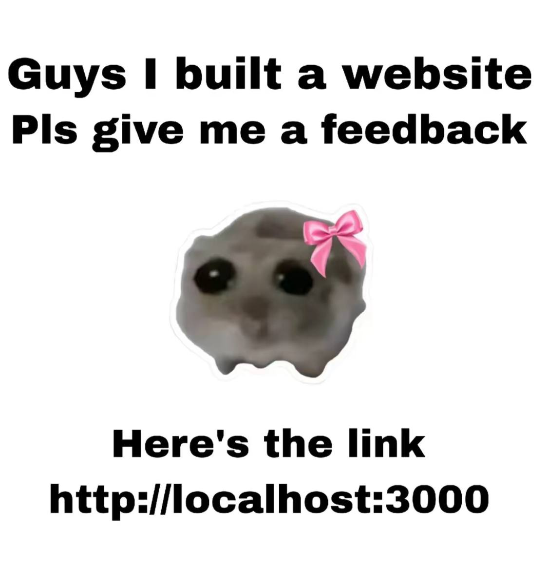

# VK internship (тестовое задание)

## Установка и заупск

```sh
# Установите зависимоси:
npm ci

# Запустите проект:
npm run start
```

## Стек технологий

- React Query
- MobX
- Ant Design
- React Router
- TypeScript
- Vite
- React

## Заключение

- > "Требований к дизайну нет, можно использовать любой UI/Kit. Обосновать свой выбор"

  В целом, единственной причиной для использования Ant Design было желание попробовать и изучить эту библиотеку.

- В качестве апи я использовал api.github.com, для его работы не нужна авторизация, но есть ограничения на пользование (60 запросов в минуту). Для увеличения лимитов можно использовать токен, но его нужно создавать ручками в аккаунте.

  Проект будет работать и без этого токена.

#


